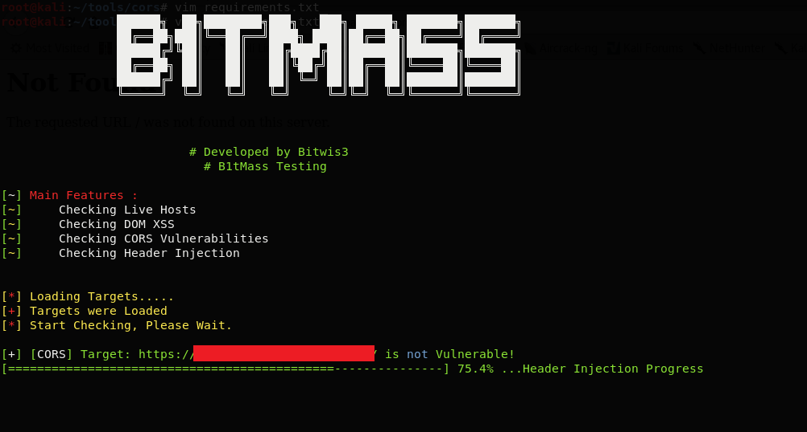
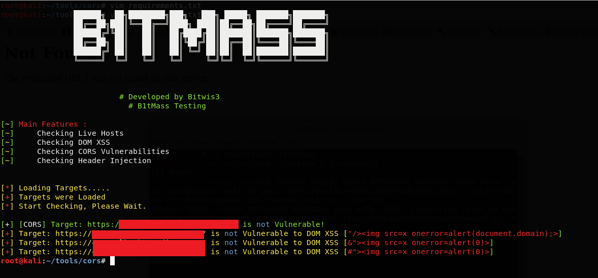
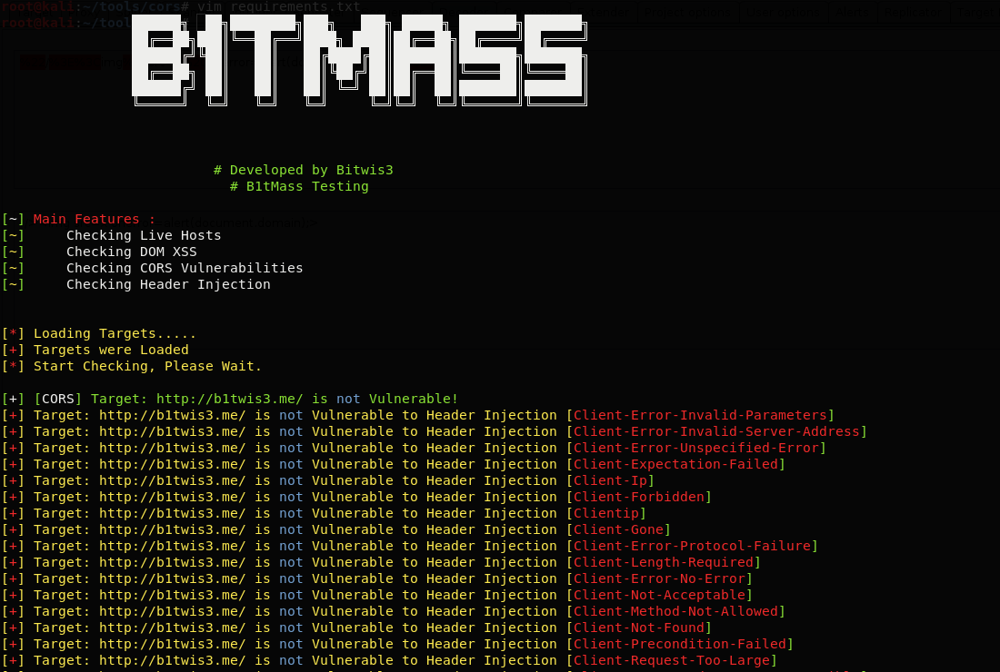

<p align="center">

</p>

<hr>
 <h3 align="center">Multiple Weaknesses  Checking for Mass Subdomains</h3>
 
<p align="center">
  <a href="https://github.com/Leoid/B1tMass/releases">
    
  </a>
  <a href="https://travis-ci.com/Leoid/B1tMass">
    
  </a>
 <a href="https://github.com/Leoid/B1tMass/issues?q=is%3Aissue+is%3Aclosed">
      
  </a>
</p>

<p align="center">

</p>
<p align="center">

</p>
<p align="center">

</p>

### Main Features
* Checking Live Hosts
* Checking DOM XSS
* Checking CORS Vulnerabilities
* Checking Header Injection

## Usage
```python3 b1tmass.py [subdomains text file] [attacker site for CORS test]```

## Contribution, Credits & License
### Ways to contribute

* Suggest a feature
* Report a bug
* Fixing Issues

Licensed under the GNU GPLv3, see LICENSE for more information.
